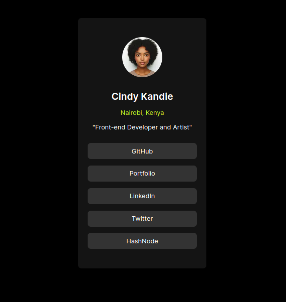

# Cindy Kandie's Portfolio

This project is a personal portfolio website for Cindy Kandie, a front-end developer and artist. It showcases her work, skills, and provides links to her social media profiles.

## ScreenShot


## Features

- Introduction and profile image
- Links to GitHub, LinkedIn, Twitter, and Instagram
- Built with Next.js for modern web development

## Technologies Used

- Next.js
- React
- CSS

## Getting Started

### Prerequisites

Make sure you have the following installed:

- Node.js
- npm or yarn

### Installation

1. Clone the repository:

   ```bash
   git clone https://github.com/cindykandie/social-links-cindyk
   cd cindy-kandie-portfolio
   ```

2. Install dependencies:

   ```bash
   npm install
   ```

   or

   ```bash
   yarn install
   ```

### Running the Development Server

Start the development server:

```bash
npm run dev
```

or

```bash
yarn dev
```

Open [http://localhost:3000](http://localhost:3000) in your browser to see the website.

## Deployment

To deploy the project, follow the instructions for your chosen hosting provider. For example, you can deploy it to Vercel by connecting your GitHub repository to Vercel and following their deployment steps.

## Contributing

If you have suggestions or improvements, feel free to submit a pull request or open an issue.

## License

This project is licensed under the MIT License.

## Contact

You can reach Cindy Kandie via her [LinkedIn](https://www.linkedin.com/in/cindykandie) or [Twitter](https://twitter.com/cindy_kandie).

```
